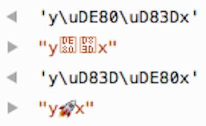

#6. string의 새 기능 `New string features`

##6.1 개요 `Overview`
새로 추가된 string method들은 다음과 같다. 
> New string methods:
```js
'hello'.startsWith('hell');    // true
'hello'.endsWith('ello');      // true
'doo '.repeat(3);              // 'doo doo doo '
```

ES6에는 또 'template literal'이라고 하는 전혀 새로운 string literal이 도입되었다.
> ES6 has a new kind of string literal, the template literal:

```js
// template literal - backtick(`)을 통한 문자열 보간(string interpolation)
// String interpolation via template literals (in backticks)
const first = 'Jane';
const last = 'Doe';
console.log(`Hello ${first} ${last}!`);    // Hello Jane Doe!

// Template literal은 여러줄의 문자열을 만들 수 있도록 해준다.
// Template literals also let you create strings with multiple lines
const multiLine = `
This is
a string
with multiple
lines`;
```


##6.2 Unicode code point escapes
ES6에서는 16비트를 초과한 경우(non-BMP Unicode)까지 포함한 모든 Unicode의 code point를 특정할 수 있는 새로운 Unicode escape가 도입되었다.
_non-BMP Unicode : 둘 또는 그 이상의 16비트 unicode unit으로 이루어진 하나의 문자_
> In ECMAScript 6, there is a new kind of Unicode escape that lets you specify any code point (even those beyond 16 bits):

```js
console.log('\u{1F680}'); 
    // ES6: single code point (16비트 하나로 이루어진 하나의 문자)
console.log('\uD83D\uDE80');
    // ES5: two code units (16비트단위의 유니코드 두 개로 이루어진 하나의 문자)
```
Unicode 챕터에서 escape에 관해 더 자세히 살펴볼 것이다.
> More information on escapes is given in the chapter on Unicode.


##6.3 String interpolation, multi-line string literals and raw string literals
Template literal은 세 가지 흥미로운 기능을 제공한다. 각 챕터에서 더 깊이있게 다룰 예정이다.
> Template literals are described in depth in their own chapter. They provide three interesting features.

#####1) template literal은 문자열 보간(interpolation)을 지원한다.
_보간 : 사이에 무언가를 끼워넣는 행위._
> First, template literals support string interpolation:

```js
const first = 'Jane';
const last = 'Doe';
console.log(`Hello ${first} ${last}!`);    // Hello Jane Doe!
```

#####2) template literal은 여러줄로 이루어질 수 있다.
> Second, template literals can contain multiple lines:

```js
const multiLine = `
This is
a string
with multiple
lines`;
```

#####3) template literal은 String.raw 태그함수를 이용하면 \n과 같은 escape 문자를 해석하지 않은 채 날것 그대로의 문자열로 만들 수 있다.
> Third, template literals are “raw” if you prefix them with the tag String.raw – the backslash is not a special character and escapes such as \n are not interpreted:

```js
const str = String.raw `Not a newline: \n`;
console.log(str === 'Not a newline: \\n');    // true
```

##6.4 Iterating over strings
문자열은 이터러블하다. 즉 for-of 구문을 통해 문자열 내의 문자들을 각각 순회하며 처리할 수 있다.
> Strings are iterable, which means that you can use for-of to iterate over their characters:

```js
for (const ch of 'abc') {
    console.log(ch);
}
// a
// b
// c
```

또한 spread operator(`...`)을 이용하여 문자열을 배열로 치환할 수도 있다.
> And you can use the spread operator (...) to turn strings into Arrays:

```js
const chars = [...'abc'];    // ['a', 'b', 'c']
```


###6.4.1 Unicode code point에 적절히 대응하는 iteration
문자열 iterator는 문자열을 코드포인트 영역별로 분리하여 순회한다. 즉 two code units(16비트 단위의 유니코드 두 개로 이루어진 하나의 문자)에 대해 16비트별로 분리해서 두 개의 문자로 인식/반환하는 것이 아니라, 영리하게 하나로 인식한다(length는 그대로 2를 출력한다).
> The string iterator splits strings along code point boundaries, which means that the strings it returns comprise one or two JavaScript characters:

```js
for (const ch of 'x\uD83D\uDE80y') {
    console.log(ch.length);
}
// 1 (x)
// 2 (\uD83D\uDE80)
// 1 (y)
```

###6.4.2 Counting code points
문자열 내에 존재하는 Unicode code points들을 빠르게 카운트할 수 있다.
> Iteration gives you a quick way to count the Unicode code points in a string:

```js
[...'x\uD83D\uDE80y'].length    // 3
```

###6.4.3 non-BMP code points에 대한 문자열 뒤집기 `Reversing strings with non-BMP code points`

non-BMP code point를 포함한 문자열의 순서를 뒤집는 데에도 iteration이 도움이 된다.
> Iteration also helps with reversing strings that contain non-BMP code points (which are larger than 16 bit and encoded as two JavaScript characters):

```js
const str = 'x\uD83D\uDE80y';

console.log(str);   // x🚀y

// ES5: \uD83D와 \uDE80를 별개의 문자로 인식하여 전혀 다른 문자를 출력한다.
console.log(str.split('').reverse().join(''));
    // y��x ('y\uDE80\uD83Dx')

// ES6: \uD83D\uDE80를 하나의 단어로 인식하여 보존한다.
console.log([...str].reverse().join(''));
    // y🚀x ('y\uD83D\uDE80x')
```

>The two reversed strings in the Firefox console.


>####  남겨진 문제점: comining marks `Remaining problem: combining marks`
combining mark는 하나의 단어로 표시되는 두 개의 유니코드 code point이다. ES6는 non-BMP code point에 대한 문자열 뒤집기에 대해서 앞서 설명한 바와 같이 하나의 단어로 인식하여 보존해주고 있으나, combining mark에 대해서는 아직 그러지 못하고 있다. 따라서 당장 combining mark에 대해서도 같은 방식으로 동작하게끔 하기 위해서는 Mathias Bynens의 [Esrever](https://github.com/mathiasbynens/esrever)와 같은 라이브러리를 활용하는 수밖에 없다.
`A combining mark is a sequence of two Unicode code points that is displayed as single symbol. The ES6 approach to reversing a string that I have presented here works for non-BMP code points, but not for combining marks. For those, you need a library, e.g. Mathias Bynens’ Esrever.`


##6.5 code point의 수치화 `Numeric values of code points`
새롭게 도입된 `codePointAt(index)` 메서드는 문자열의 index 위치에 해당하는 문자의 code point를 수치화하여 반환해준다.
> The new method codePointAt() returns the numeric value of a code point at a given index in a string:

```js
const str = 'x\uD83D\uDE80y';
console.log(str.codePointAt(0).toString(16)); // 78
console.log(str.codePointAt(1).toString(16)); // 1f680
console.log(str.codePointAt(3).toString(16)); // 79
```

이 메서드는 문자열 iteration 내에서도 잘 동작한다.
> This method works well when combined with iteration over strings:

```js
for (const ch of 'x\uD83D\uDE80y') {
    console.log(ch.codePointAt(0).toString(16));
}
// 78
// 1f680
// 79
```

`String.fromCodePoint()`메서드는 `codePointAt()` 메서드의 반대되는 기능을 한다.
> The opposite of codePointAt() is String.fromCodePoint():

```js
String.fromCodePoint(0x78, 0x1f680, 0x79) === 'x\uD83D\uDE80y'  // true
```


##6.6 포함 여부 확인 `Checking for inclusion`

ES6에서는 문자열 내에 지정한 문자열이 포함되었는지 여부를 판단해주는 세 가지 메서드가 추가되었다.
> Three new methods check whether a string exists within another string:

```js
'hello'.startsWith('hell');    // true
'hello'.endsWith('ello');      // true
'hello'.includes('ell');       // true
```

이들 각 메서드들은 추가적으로 두 번째 파라미터에 검색 시작 위치를 지정할 수도 있다.
> Each of these methods has a position as an optional second parameter, which specifies where the string to be searched starts or ends:

```js
'hello'.startsWith('ello', 1)    // true
'hello'.endsWith('hell', 4)      // true

'hello'.includes('ll', 1)        // true
'hello'.includes('ll', 3)        // false
```


##6.7 문자열 반복 ` Repeating strings`

`repeat()` 메서드는 문자열을 파라미터값만큼 반복한 결과를 반환한다.
> The `repeat()` method repeats strings.

```js
'doo '.repeat(3)    // 'doo doo doo '
```


##6.8 String methods that delegate regular expression work to their parameters

In ES6, the four string methods that accept regular expression parameters do relatively little. They mainly call methods of their parameters:

- String.prototype.match(regexp) calls regexp[Symbol.match](this).
- String.prototype.replace(searchValue, replaceValue) calls searchValue[Symbol.replace](this, replaceValue).
- String.prototype.search(regexp) calls regexp[Symbol.search](this).
- String.prototype.split(separator, limit) calls separator[Symbol.split](this, limit).

The parameters don’t have to be regular expressions, anymore. Any objects with appropriate methods will do.

##6.9 Cheat sheet: the new string methods (요약)
Tagged templates:

String.raw(callSite, ...substitutions) : string
Template tag for “raw” content (backslashes are not interpreted):
```js
String.raw`\` === '\\'
// true
```

Consult the chapter on template literals for more information.

Unicode and code points:
+ `String.fromCodePoint(...codePoints : number[]) : string`

  Turns numbers denoting Unicode code points into a string.

+ `String.prototype.codePointAt(pos) : number`

  Returns the number of the code point starting at position pos (comprising one or two JavaScript characters).

+ `String.prototype.normalize(form? : string) : string`

  Different combinations of code points may look the same. Unicode normalization changes them all to the same value(s), their so-called canonical representation. That helps with comparing and searching for strings. The 'NFC' form is recommended for general text.


Finding strings:

+ `String.prototype.startsWith(searchString, position=0) : boolean`

  Does the receiver start with searchString? position lets you specify where the string to be checked starts.

+ `String.prototype.endsWith(searchString, endPosition=searchString.length) : boolean`

  Does the receiver end with searchString? endPosition lets you specify where the string to be checked ends.

+ `String.prototype.includes(searchString, position=0) : boolean`

  Does the receiver contain searchString? position lets you specify where the string to be searched starts.


Repeating strings:
+ `String.prototype.repeat(count) : string`

  Returns the receiver, concatenated count times.
